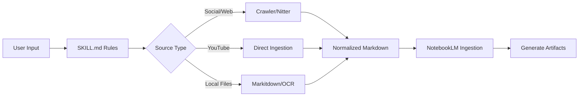
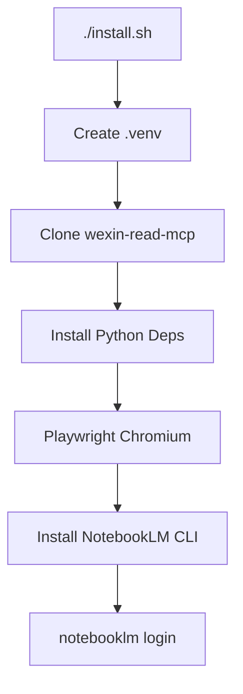

# anything-to-notebooklm

> **LLM/Agent Directive**: 
> 若你是 AI 代理或 CLI 助手，請優先讀取 [SKILL.md](./SKILL.md) 以獲取完整的執行規則與決策邏輯。
> 在執行任何功能前，請確保已完成 `./install.sh` 並通過 `./check_env.py` 驗證。

這是一個為 AI 代理工具（如 Gemini CLI, Codex, OpenClaw, Antigravity 等）設計的 NotebookLM 整合工具箱。它能將各種雜亂的來源（網頁、影片、文件）正規化後匯入 NotebookLM，並驅動產生多樣化的產物（Podcast, Slide, Mind Map 等）。

---

## 🚀 快速開始 (Quick Start)

本專案採 **Runtime-First** 設計，必須先安裝本機執行環境：

```bash
# 1. 安裝環境 (含 Python venv, Playwright, CLI 工具)
./install.sh

# 2. 登入 NotebookLM (會開啟瀏覽器)
./.venv/bin/notebooklm login

# 3. 驗證環境
./check_env.py
```

驗證成功後，你可以直接使用 `notebooklm` 指令：
```bash
export PATH="$(pwd)/.venv/bin:$PATH"
notebooklm list
notebooklm source add "https://www.youtube.com/watch?v=Wye0r7uCh5s"
```

---

## 🛠️ 核心功能與設計 (Core Capabilities)

本工具的核心價值在於 **「萬物皆可 NotebookLM」**。它不僅僅是一個 Prompt，而是一套完整的執行流程：

### 1. 支援的輸入來源 (Input Sources)
*   **Social Media**: 支援 `X/Twitter` 串文（優先透過 `Nitter` fallback 確保穩定性）。
*   **Video**: 自動擷取 `YouTube` 字幕與資訊。
*   **Web**: 一般網頁、部落格，以及受限制來源（如微信公眾號，需搭配 MCP）。
*   **Documents**: `PDF`, `DOCX`, `PPTX`, `XLSX`, `EPUB`, `Markdown`, `TXT`。
*   **Multimedia**: 圖片 `OCR` (JPG, PNG) 與音訊轉文字 (MP3, WAV)。

### 2. 產出的格式矩陣 (Output Artifacts)
只要內容進入 NotebookLM，即可透過指令生成：
*   **Audio**: Podcast / Audio Overview
*   **Writing**: 專業報告 (Report), 摘要 (Summary)
*   **Study**: 測驗 (Quiz), 閃卡 (Flashcards)
*   **Visual**: 心智圖 (Mind Map), 簡報 (Slide Deck), 資訊圖表 (Infographic)
*   **Video**: 影片 (Video), 電影感影片 (Cinematic Video)
*   **Data**: 結構化資料表 (Data Table)

---

## 📦 安裝指引 (Installation)

### 通用安裝 (General)
建議直接 Clone 本 Repo 並執行 `./install.sh`。它會建立一個獨立的 `.venv`，不會污染你的系統環境。

### OpenClaw 安裝
本 Repo 應安裝為 OpenClaw 的 **Skill Directory** 而非 Plugin：

```bash
mkdir -p ~/.openclaw/skills
ln -s /path/to/anything-to-notebooklm ~/.openclaw/skills/anything-to-notebooklm
cd ~/.openclaw/skills/anything-to-notebooklm
./install.sh
```
安裝後，OpenClaw 會自動從 `SKILL.md` 發現此技能。

---

## 📊 執行流程 (Diagrams)

### 執行邏輯 (Runtime Flow)


### 安裝流程 (Installation Flow)


---

## 💡 為何重寫此專案？ (Context)

原始版本高度耦合於特定環境。本版本（v2.0+）進行了以下優化：
1.  **Capability-Based**: 從工具依賴轉向能力依賴，支援多種代理工具。
2.  **Agent-Executable**: 將流程寫成 LLM 可理解的決策規則 (`SKILL.md`)。
3.  **Full Automation**: 包含完整的本機 Runtime 安裝腳本，不再只是文字說明。

**Source / 來源**: 靈感啟發自 [joeseesun/anything-to-notebooklm](https://github.com/joeseesun/anything-to-notebooklm)，本 Repo 為繁體中文優化與多工具實作版。
